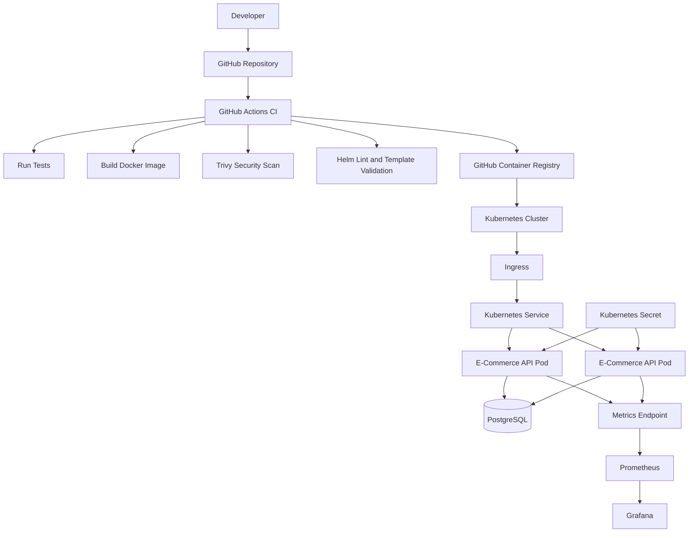

# 🚀 DevOps Production Platform

[](https://github.com/akashfrancis3211/devops-production-platform/actions/workflows/ci.yml)
[](https://github.com/akashfrancis3211/devops-production-platform/actions/workflows/cd.yml)
[](https://www.docker.com/)
[](https://kubernetes.io/)
[](https://helm.sh/)
[](https://trivy.dev/)

A production-style **E-Commerce Order Platform** built to demonstrate modern DevOps and DevSecOps practices across application delivery, containerization, Kubernetes, CI/CD, security, and observability.

## 🎯 Project Goal

This project demonstrates how an application moves through a realistic delivery lifecycle:

```text
Developer → GitHub → CI → Docker → GHCR → Helm/Kubernetes
                         │
                         ├── Tests
                         ├── Security scanning
                         ├── Helm validation
                         └── Monitoring validation
```

The project is designed as a portfolio/reference implementation without requiring a paid cloud Kubernetes cluster.

---

## 🏗️ Architecture



## 🧰 Technology Stack

| Area             | Technology                            |
| ---------------- | ------------------------------------- |
| Application      | FastAPI                               |
| Language         | Python 3.12                           |
| Database         | PostgreSQL                            |
| Containerization | Docker                                |
| Registry         | GitHub Container Registry             |
| Orchestration    | Kubernetes                            |
| Packaging        | Helm                                  |
| CI/CD            | GitHub Actions                        |
| Security         | Trivy + Kubernetes security hardening |
| Monitoring       | Prometheus + Grafana                  |
| Metrics          | prometheus-fastapi-instrumentator     |
| Infrastructure   | Terraform                             |
| Testing          | Pytest                                |

---

## ✨ Application Features

* Product management
* PostgreSQL persistence
* Health endpoint
* Prometheus metrics endpoint
* Automated API tests
* Containerized application runtime

### API Endpoints

| Endpoint         | Purpose                 |
| ---------------- | ----------------------- |
| `GET /`          | Application information |
| `GET /health`    | Health check            |
| `GET /products`  | List products           |
| `POST /products` | Create a product        |
| `GET /metrics`   | Prometheus metrics      |

---

## 🔄 CI/CD Pipeline

Every push to `main` and pull request targeting `main` is validated through GitHub Actions.

### CI Flow

```text
Checkout
   ↓
Python setup
   ↓
Install dependencies
   ↓
Initialize PostgreSQL
   ↓
Run Pytest
   ↓
Build Docker image
   ↓
Push image to GHCR
   ↓
Verify image
   ↓
Helm lint
   ↓
Helm template validation
   ↓
Security-context validation
   ↓
ServiceMonitor validation
   ↓
Trivy scan
   ↓
Trivy security gate
   ↓
Package Helm chart
```

The pipeline publishes images using the commit SHA, providing immutable image references.

---

## 🔐 DevSecOps & Kubernetes Hardening

The deployment configuration includes:

* Non-root container execution
* Read-only root filesystem
* Privilege escalation disabled
* All Linux capabilities dropped
* Seccomp `RuntimeDefault`
* External Kubernetes Secret reference
* Required `DATABASE_URL` secret key
* CPU and memory requests
* CPU and memory limits
* Readiness probe
* Liveness probe
* Automated Trivy HIGH/CRITICAL vulnerability scanning
* CI regression checks for Kubernetes security settings

Secrets are intentionally **not stored in Git**.

The Helm chart references an externally managed Kubernetes Secret named:

```text
ecommerce-api-secret
```

---

## 📦 Helm

The Helm chart supports:

* Configurable replicas
* Container image repository/tag
* Service configuration
* Resource requests/limits
* Security context
* External secrets
* Health probes
* Optional Ingress
* Development and production values

Example immutable image:

```text
ghcr.io/akashfrancis3211/ecommerce-api:<commit-sha>
```

Using a commit SHA instead of `latest` makes deployments reproducible and traceable.

---

## 📊 Monitoring

The application exposes Prometheus metrics through:

```text
/metrics
```

A Kubernetes `ServiceMonitor` is included for Prometheus Operator environments.

Monitoring configuration includes:

* Prometheus
* Grafana
* ServiceMonitor
* 15-second metrics scrape interval
* Application-level metrics instrumentation

---

## 📁 Repository Structure

```text
devops-production-platform/
├── .github/
│   └── workflows/
│       ├── ci.yml
│       └── cd.yml
├── app/
│   ├── crud.py
│   ├── database.py
│   ├── main.py
│   ├── models.py
│   ├── requirements.txt
│   └── schemas.py
├── docker/
│   └── Dockerfile
├── helm/
│   └── ecommerce-api/
├── k8s/
├── monitoring/
├── scripts/
├── terraform/
├── tests/
├── docker-compose.yml
└── README.md
```

---

## 🚀 Deployment Model

The project is intentionally deployment-ready rather than tied to a paid Kubernetes cluster.

The Helm chart can be rendered and validated through GitHub Actions, while the CD workflow packages and validates the deployment manifests.

For a real Kubernetes environment, the required external database Secret must exist in the `ecommerce` namespace before deploying the application.

---

## 🧪 Quality & Security Checks

The CI pipeline automatically validates:

* Application tests
* Docker image build
* Published image
* FastAPI/Starlette runtime
* Helm chart syntax
* Helm rendered manifests
* Ingress rendering
* Kubernetes Secret references
* Security context
* Seccomp profile
* ServiceMonitor configuration
* Trivy vulnerability results

This integrates **application testing, infrastructure validation, and security controls into CI/CD**.

---

## 🎓 DevOps Concepts Demonstrated

* Git and GitHub
* CI/CD
* GitHub Actions
* Docker
* Container registries
* Kubernetes
* Helm
* Ingress
* Services
* ConfigMaps/Secrets
* Resource management
* Health probes
* Container security
* Trivy
* Prometheus
* Grafana
* Infrastructure as Code
* Deployment validation
* Immutable image versioning

---

## 👤 Author

**Akash Francis**

DevOps / DevSecOps learning portfolio focused on automation, Kubernetes, cloud-native infrastructure, security, and reliable software delivery.

---

## ⭐ Project Status

**Production-style portfolio project — completed.**

The repository focuses on demonstrating the engineering workflow and deployment architecture rather than maintaining a permanently running paid cloud environment.
